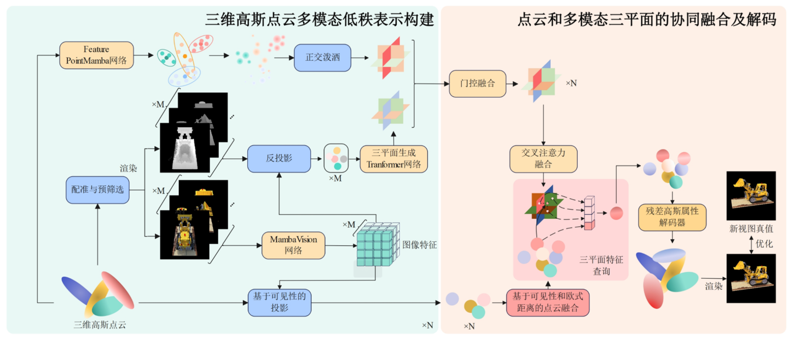
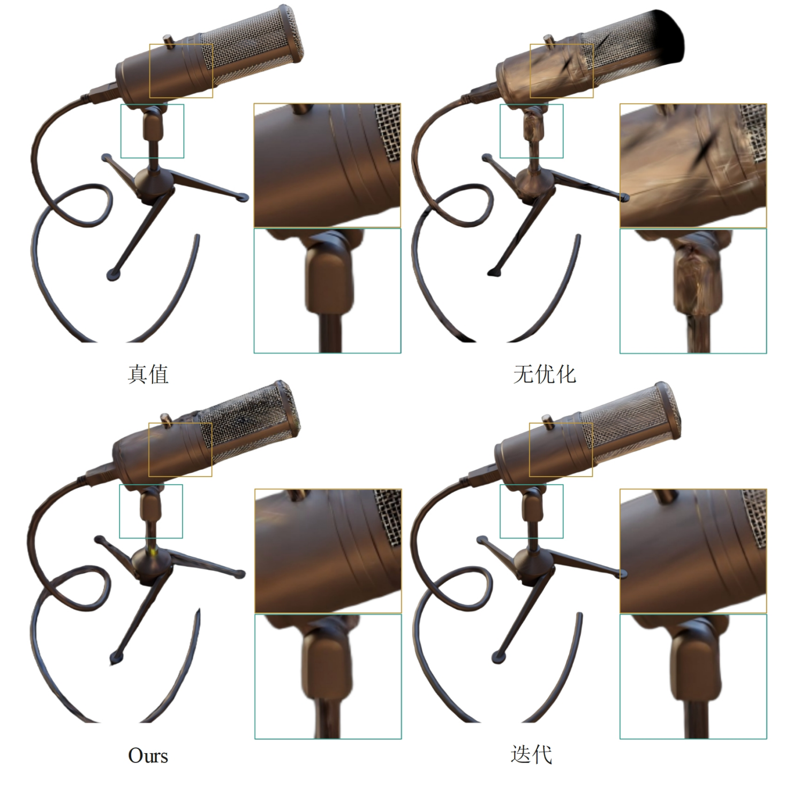
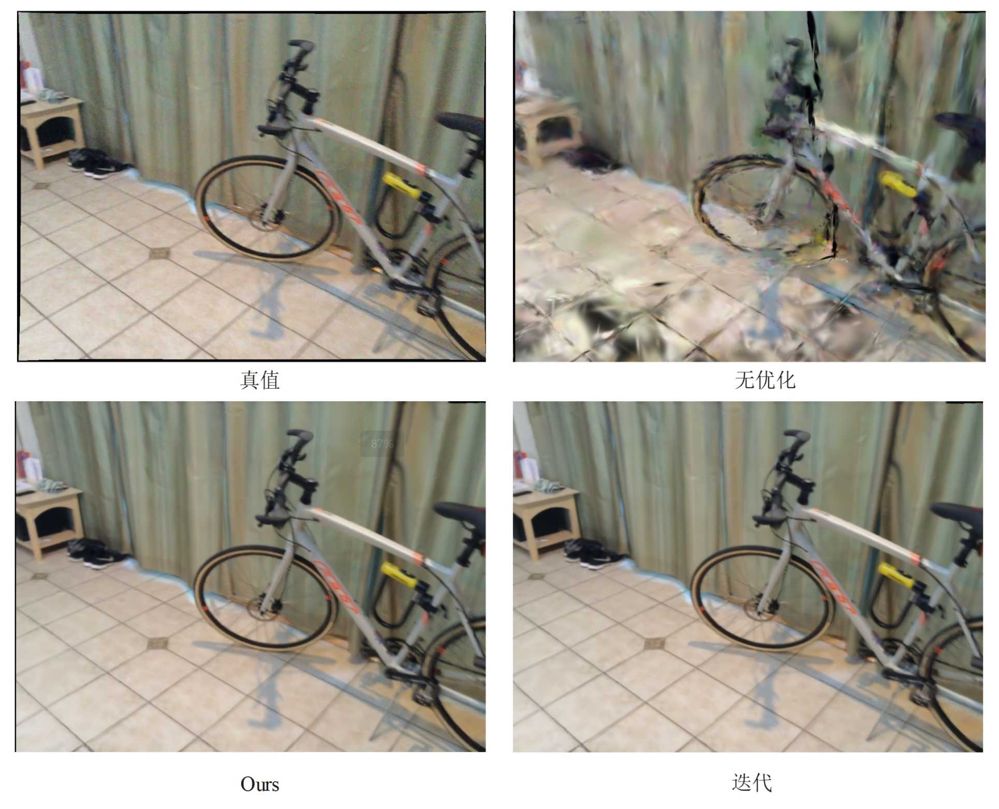
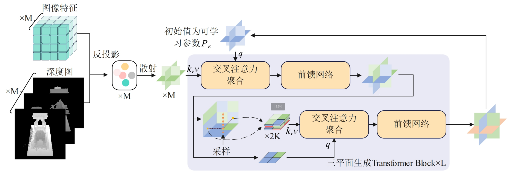
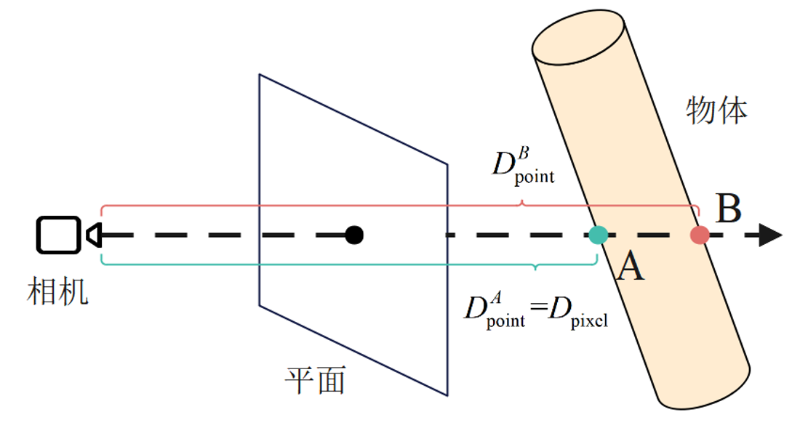
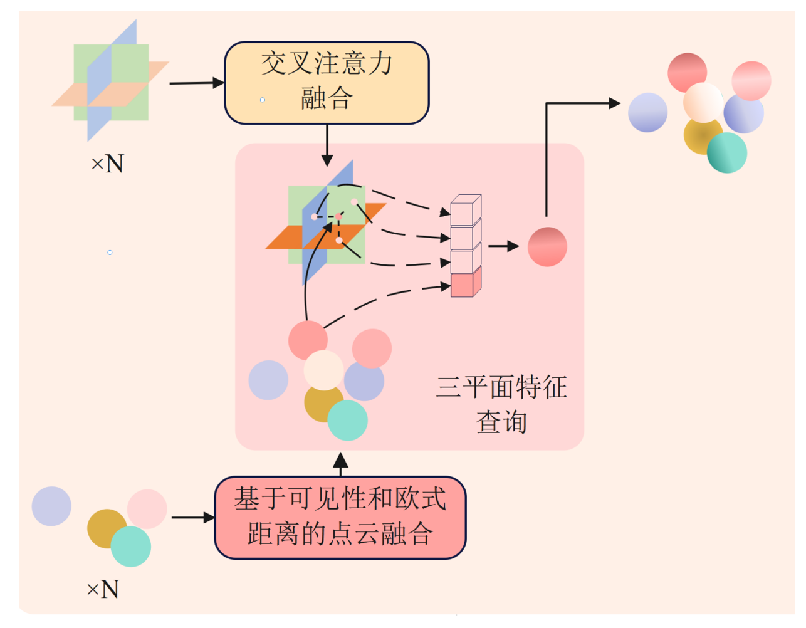
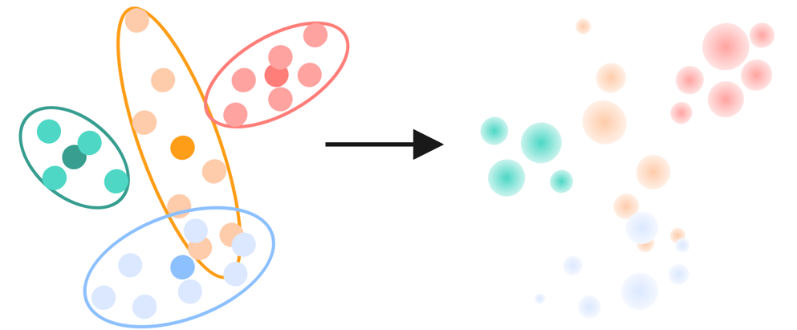

# TriplaneGS-Fuser: Fuse the GS models of several parts within a few seconds



## TriplaneGS-Fuser

本项目基于[TriplaneGaussian](https://github.com/VAST-AI-Research/TriplaneGaussian).框架，提出一种基于低秩表示的高效无监督3D高斯散射模型配准与融合框架，旨在解决传统3DGS模型融合优化过程中效率低下问题。

## 📊 效果对比 (Performance Comparison)

NeRF Synthetic数据集完整管线的定量结果

|      模型      |  PSNR ↑   |  SSIM ↑   |  LPIPS ↓  | Time(s) ↓ |
| :------------: | :-------: | :-------: | :-------: | :-------: |
|     无优化     |   25.23   |   0.803   |   0.241   |           |
|    迭代融合    |   31.72   |   0.973   |   0.031   |  117.2s   |
| 3DGS-10k(真值) | **32.84** | **0.980** |   0.032   |     -     |
|   Ours(前馈)   |   32.03   |   0.977   | **0.019** | **3.6s**  |

ScanNet-GSReg数据集的定量结果

|      模型      |  PSNR ↑   |  SSIM ↑   |  LPIPS ↓  | Time(s) ↓ |
| :------------: | :-------: | :-------: | :-------: | :-------: |
|     无优化     |   18.92   |   0.732   |   0.413   |     -     |
|    迭代融合    |   22.46   |   0.822   |   0.337   |  142.1s   |
| 3DGS-10k(真值) | **23.51** | **0.857** | **0.335** |     -     |
|   Ours(前馈)   |   21.70   |   0.791   |   0.342   | **4.8s**  |

TriplaneGS-Fuser可以在几秒内完成高质量的融合





## 🔧 核心改进 (Key Improvements)

+ 同3DGS的Splatting渲染RGB图类似，使用Splatting渲染特征三平面



+ 多模态（连续和离散表示）的融合



+ 基于点组分布高斯化的三平面建构



## 🚀 使用 (Usage)

+ 复制项目

```shell
git clone https://github.com/THUSlll/TriPlaneGS-Fuser.git
```

+ 配置Conda环境

```
conda env create -f environment.yml
```

注意！这里关于diff-gaussian-rasterization的安装并非来自标准包，而是Feature-Splatting，你可以在[Spacetime Gaussian Feature Splatting](https://github.com/oppo-us-research/SpacetimeGaussians/tree/main)中找到它的安装包

### 数据准备 (Data prepare)

你的数据应该这样存放：

```
<location>
|---train
|   |---scene 0
|   |	|---part 0
|   |	|	|---image
|   |	|	|---output
|   |	|---part 1
|   |	|...
|   |---scene 1
|   |---...
|---test
	|---...
```

### 训练 (Train)

预先计算你的数据中的深度：

```
python render_depth.py --config config/config_new.yaml --exp_name your_exp_name
```

训练你的模型

```
python train.py --config config/config_fuse.yaml --exp_name your_exp_name
```

## Acknowledgements

我们的工作基于这些优秀的工作 [Spacetime Gaussian Feature Splatting](https://github.com/oppo-us-research/SpacetimeGaussians/tree/main)，[TriplaneGaussian](https://github.com/VAST-AI-Research/TriplaneGaussian)，[gaussian-splatting](https://github.com/graphdeco-inria/gaussian-splatting)，[MambaVision](https://github.com/NVlabs/MambaVision)，[PointMamba](https://github.com/LMD0311/PointMamba)，感谢这些团队的开源分享。